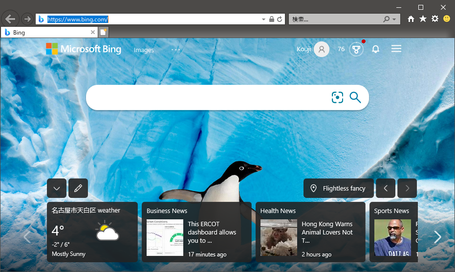

# Outernet Explorer

An old-style web browser stub, comes from Internet Explorer was genocided on Windows.


Download from: https://github.com/kekyo/OuternetExplorer/releases/download/1.0.0/oexplore.zip

* NOTE: Windows defender will report "Infected with a virus", but it doesn't contain any security risks.
I feel this is a bug in Windows defender or something Microsoft has thought about this project...
If you can't believe it, you can verify source code and/or build a binary yourself. It is an OSS project :)

---

## What's this?

A stub implementation for Internet Explorer ActiveX component (called `MSHTML`, `ShDocVw`, `InternetExplorer.Application` and like). It's simplest replacer for `iexplore.exe`.

The Internet Explorer will retire at June 15, 2022. We need to be prepared for that, this is one of the most innovative ideas.

Reference:

* [The future of Internet Explorer on Windows 10 is in Microsoft Edge (Microsoft)](https://blogs.windows.com/windowsexperience/2021/05/19/the-future-of-internet-explorer-on-windows-10-is-in-microsoft-edge/)
* [Microsoft is finally retiring Internet Explorer in 2022 (THE VERGE)](https://www.theverge.com/2021/5/19/22443997/microsoft-internet-explorer-end-of-support-date)

## Target platforms

* Intel x86 32bit architecture Windows between Windows 11 and Windows NT 4.0 (maybe).
* You could run on 64bit Windows implicitly uses WOW64 compatibility layer.

## Usage

* Double-click `oexplore.exe` on the Explorer.
* Or, invokes from command line:

```
C:\>oexplore.exe
```

You made it!



### Options

Outernet Explorer could receive only target url like:

```
C:\>oexplore.exe https://google.com/
```

Unfortunately, the url will inspect inside of Internet Explorer component, and maybe shows up both IE **AND** Edge2...

## License and limitation

* MIT
* This is kind of a joke. I'm hoping the code will work, please do not take it seriously :)
